# AutoMix UI/UX audit

Date: 2026-07-28

## Outcome

AutoMix already communicates “serious audio tool” well and exposes an unusually complete control surface for an autonomous mixer. The remote console is the strongest product surface: it has a clear status hierarchy, large scene controls, readable meters, and a persistent SAFE action.

The main gap is operational hierarchy. The browser console and native utility expose nearly every subsystem at once. That is useful during development, but it makes the operator scan implementation detail during a live service. The browser console also breaks at a phone-sized viewport, and several custom controls do not yet expose enough accessible names or keyboard behavior.

This pass prioritizes:

1. Keep live status, scene progression, stream health, and SAFE visible.
2. Separate operate/setup/validate tasks so diagnostic detail is available without dominating the live view.
3. Make the browser console adapt to narrow windows instead of overflowing horizontally.
4. Make controls describe their effect and target, especially mute, solo, fader, pairing, and safety controls.
5. Preserve the existing dark, compact broadcast-console visual language.

## Audit evidence

All screenshots in this document were captured from the running product during this audit.

### Browser proof-of-concept

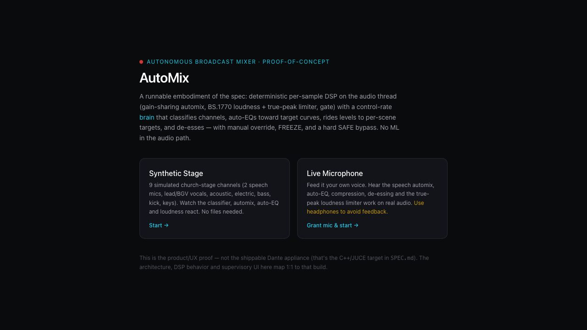

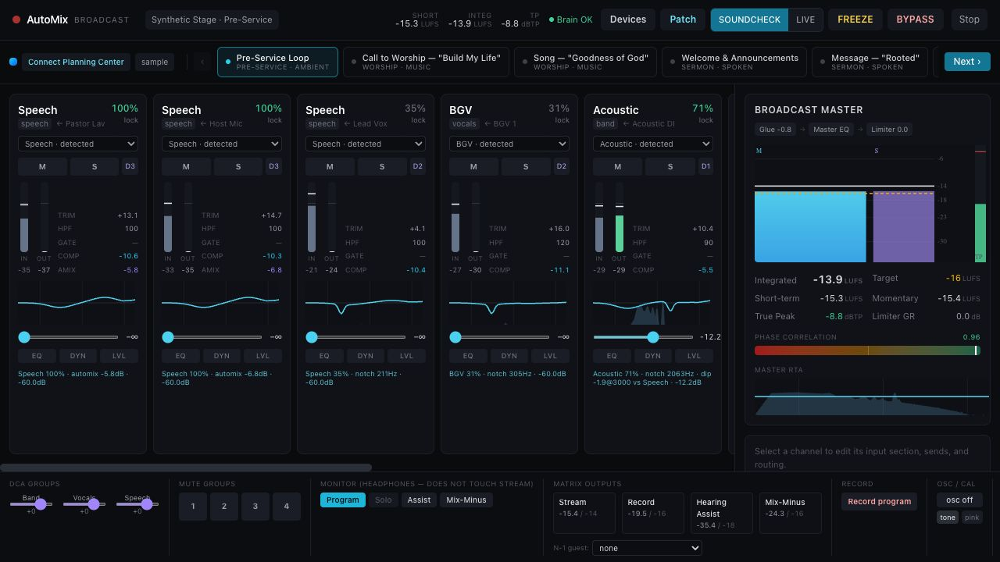

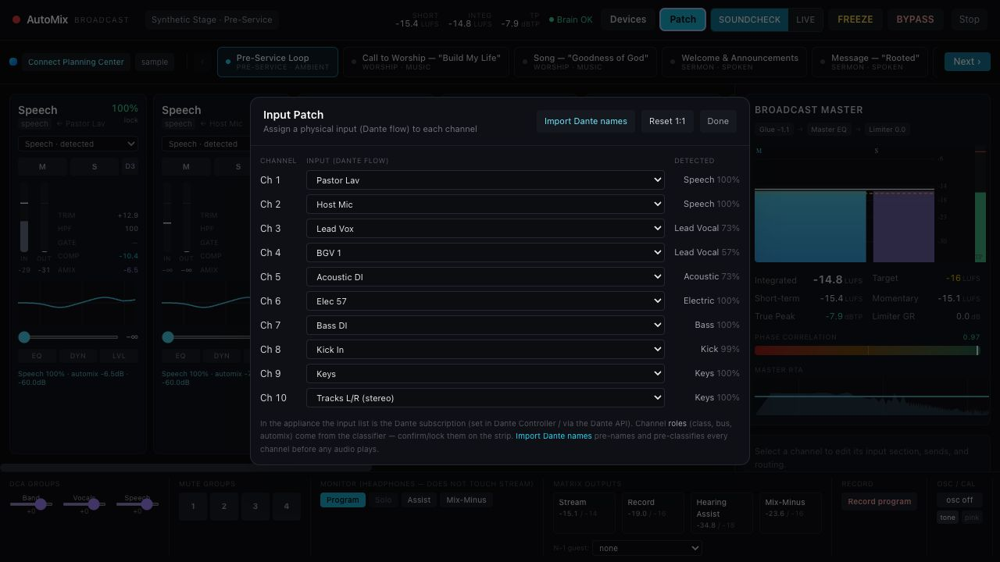

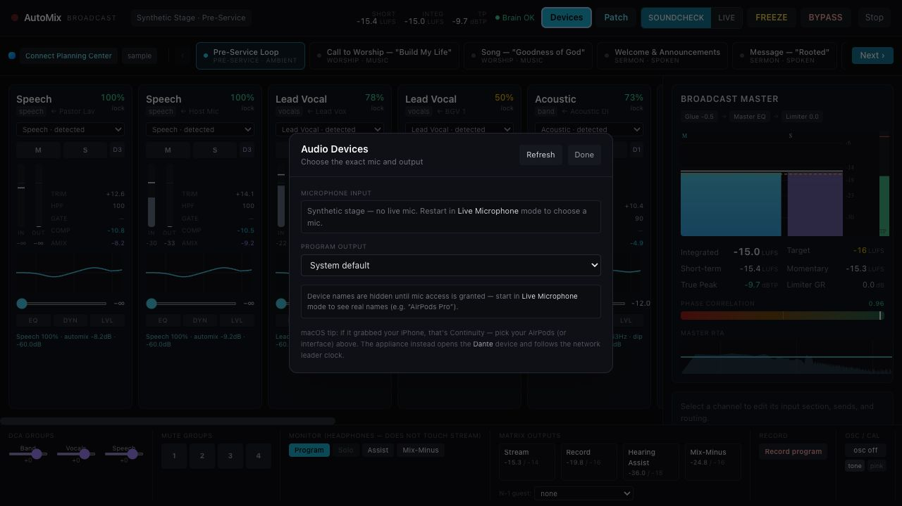

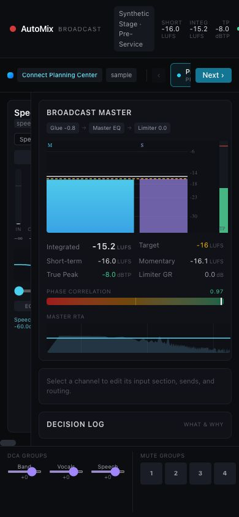

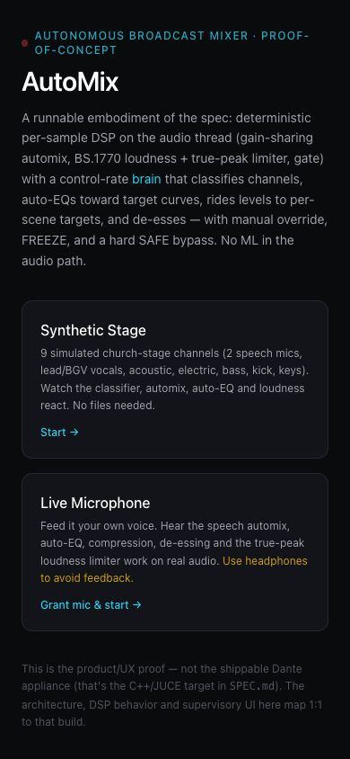

### Remote operator console

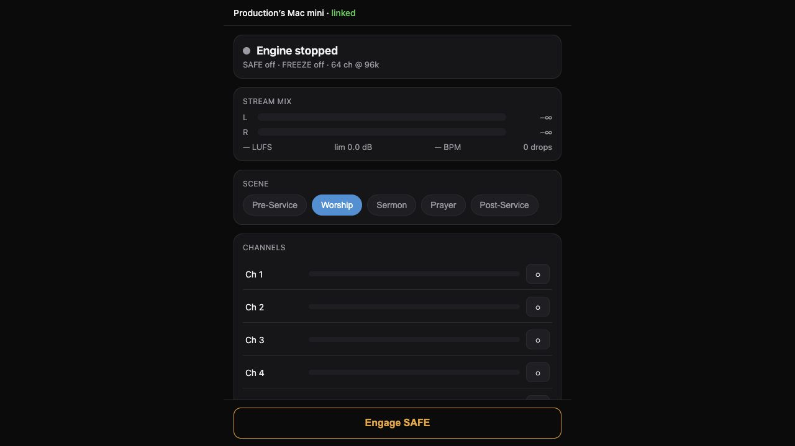

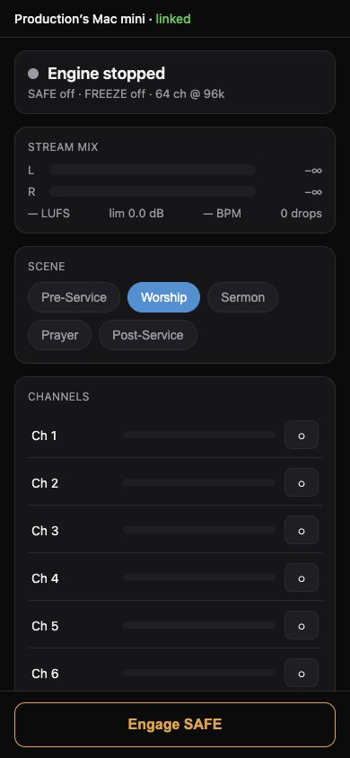

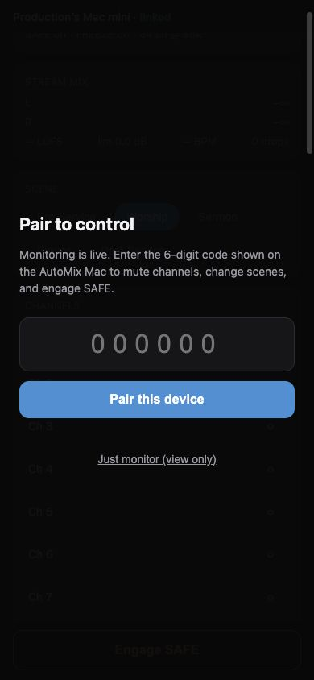

### Native macOS app

The native app was rebuilt and exercised as a running macOS application. The redesigned Live workspace is captured below; Setup, Validate, channel selection, and the SAFE-release confirmation were also checked as rendered states.

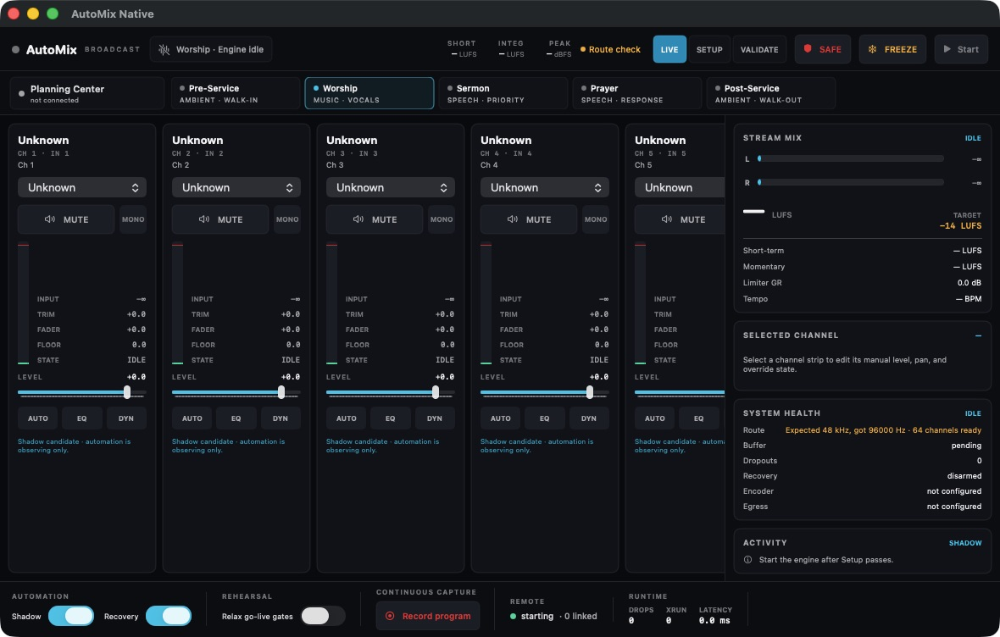

## End-to-end flow health

1. **Choose an input mode — healthy.** The two choices are clear, mutually distinct, and explain the feedback risk of a live microphone.
2. **Start the synthetic stage — healthy.** The app moves directly into a realistic console with live telemetry.
3. **Confirm devices — needs refinement.** The modal is understandable, but the main console offers Devices, Patch, Soundcheck, Live, Freeze, Bypass, and Stop with nearly equal weight.
4. **Patch inputs — mostly healthy.** The 1:1 table is efficient and the detected role is useful. The modal needs dialog semantics, labeled selectors, Escape behavior, and better narrow-window treatment.
5. **Follow the service plan — needs refinement.** The horizontal timeline makes the next cue visible, but Planning Center setup competes with the cue list during operation.
6. **Supervise channels and master — needs refinement.** The desktop view is dense but workable. Key type is extremely small, channel selection is mouse-centric, and the master/detail rail competes with the channel rack.
7. **Use the console in a narrow window — blocked in the baseline.** The layout keeps its desktop minimum width. Header controls, channel strips, the master rail, and the bottom console are clipped outside the viewport.
8. **Monitor from a phone — healthy.** Status, stream meters, scene, channels, and SAFE form a coherent vertical flow with appropriately large primary controls.
9. **Pair the phone for control — needs refinement.** The purpose is clear, but the code input is identified by its placeholder rather than a persistent label and the modal does not yet declare or enforce modal focus behavior.
10. **Operate the native app — needs refinement (code-review evidence).** A single long sidebar contains core audio, Planning Center, remote monitoring, preflight, Dante checks, stream metrics, livestream health, recording, stability, soundcheck, and hardware proof. Setup and validation detail therefore remain in the operator’s live scanning path.

## Prioritized findings

### P0 — Live controls become clipped in narrow browser windows

Evidence: `05-web-console-mobile.png`.

The console preserves a wide desktop canvas. Only part of the master rail and bottom control bar remains visible, while SAFE, Freeze, Live mode, and channel controls can sit outside the viewport. This is an operational failure, not a cosmetic issue.

Remediation: introduce a narrow layout that stacks the master rail above the horizontally scrollable channel rack, wraps the header into status and action rows, constrains the overall page width, and keeps the bottom console horizontally scrollable within the viewport.

### P0 — Safety language is inconsistent

Evidence: the browser uses “BYPASS” / “SAFE MIX,” the remote uses “Engage SAFE,” and the native app uses “SAFE.”

The same emergency state should have one name and one state model across surfaces. “Bypass” describes implementation; “SAFE” describes the operator intent.

Remediation: use “SAFE” when inactive and “SAFE ACTIVE” when engaged. Keep the implementation detail in help text.

### P1 — The browser live view has no strong hierarchy

Evidence: `02-web-console-desktop.png`.

At 1280 × 720, scene setup, ten channel strips, master loudness, routing, recording, oscillator, AI scope, history, and the decision log are all visible with similar contrast. This reads as an engineering console more than an autonomous operator console.

Remediation: preserve the dense desktop view, but strengthen three levels:

- primary: engine/brain state, current and next scene, master health, SAFE;
- secondary: channel meters and exceptional/manual states;
- tertiary: routing, oscillator, AI recall scope, full decision history.

### P1 — Native setup, operation, and validation share one long sidebar

Evidence type: current SwiftUI code review.

The native sidebar renders more than ten GroupBoxes in one scroll. The operator has no stable “live” workspace, and validation controls remain adjacent to service controls.

Remediation: add explicit Live, Setup, and Validate workspaces. Keep Core Audio available in every workspace and reveal only the task-relevant groups beneath it.

### P1 — Custom browser controls are under-described for assistive technology

Evidence: current DOM snapshots and component review.

Channel mute/solo buttons are named only “M” and “S,” channel faders are unnamed, clickable strip containers are not keyboard actions, and patch selectors do not identify their channel.

Remediation: give controls target-specific accessible names, add an explicit keyboard-operable channel edit action, and associate labels with all sliders and selectors.

### P1 — Browser modals lack dialog behavior

Evidence: `03-web-patch-desktop.png`, `04-web-devices-desktop.png`, and DOM snapshots.

The panels look modal but do not declare `role="dialog"` / `aria-modal`, label themselves as dialogs, or support Escape. Background click dismissal can also make an accidental click destructive to task progress.

Remediation: add semantic dialog labeling, Escape close, initial focus, and explicit close controls. Preserve entered values because changes are applied immediately.

### P1 — Remote channel navigation does not scale to 64 inputs

Evidence: `07-remote-console-desktop.png`, `08-remote-console-mobile.png`.

The remote console renders a flat list of all 64 channels. The large touch rows are good, but finding one source during an incident requires long scrolling.

Remediation: add a persistent channel search and All / Active / Muted filters. Keep All as the safe default so inactive microphones remain reachable.

### P2 — Remote pairing needs stronger modal and input semantics

Evidence: `09-remote-pairing-mobile.png`.

The pairing overlay is visually clear. Its numeric field needs a persistent label, the dialog needs modal semantics, background content should become inert, and focus should move into and out of the dialog predictably.

### P2 — The proof-of-concept entry copy is accurate but too implementation-led

Evidence: `01-web-entry-desktop.png`, `06-web-entry-mobile.png`.

The first paragraph leads with DSP architecture before explaining the operator outcome. The screen is otherwise calm and responsive.

Remediation: lead with “keep a livestream intelligible and broadcast-safe,” move architecture to supporting copy, and correct the synthetic-stage count to match the ten visible strips.

### P2 — The animated red brand dot reads as recording

Evidence: `01-web-entry-desktop.png`, `02-web-console-desktop.png`.

A pulsing red dot conventionally means recording/on-air, but it appears before recording and while the record control is idle.

Remediation: use a neutral/cyan product mark on the entry screen and a green engine-health indicator in the running header. Reserve pulsing red for active recording.

## Implemented in this pass

### Browser proof-of-concept

- Rebuilt the running header into a status row and horizontally contained action row.
- Kept SAFE at the leading edge of the action row so it remains visible at phone width.
- Standardized the safety state to `SAFE` / `SAFE ACTIVE`.
- Stacked the broadcast master above the channel rack at narrow widths while preserving the dense desktop rack.
- Constrained all horizontal scrolling to the service plan, channel rack, or console shortcut region instead of the document viewport.
- Added semantic page regions, service-plan navigation, pressed/current states, target-specific channel control names, and labeled faders/selectors.
- Added semantic Patch and Devices dialogs with labels, initial focus, and Escape dismissal.
- Rewrote the entry copy around the operator outcome, corrected the channel count, and reserved red animation for actual recording states.
- Added visible keyboard focus and reduced-motion handling.

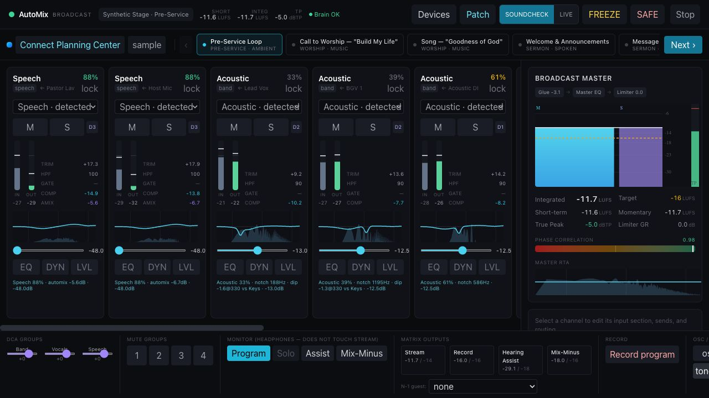

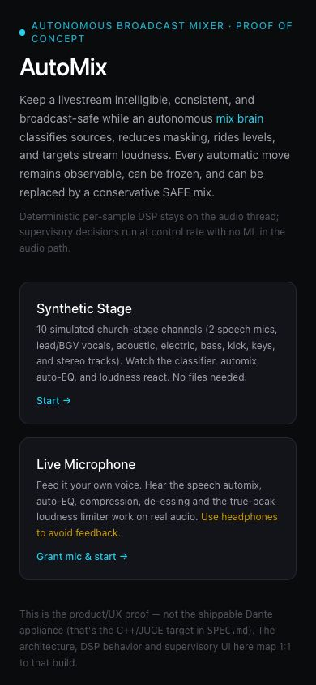

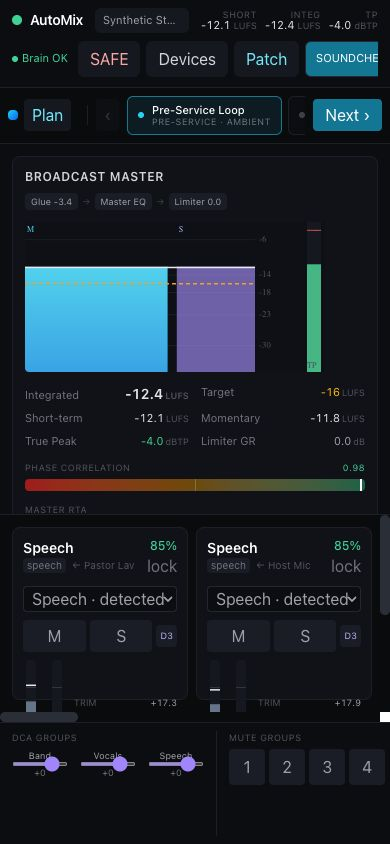

### Remote operator console

- Added channel search plus All, Active, and Muted filters while retaining All as the safe default.
- Enlarged scene and mute targets for touch.
- Made channel names keyboard-operable edit buttons with expanded state.
- Added pressed-state semantics for scenes and SAFE.
- Added a persistent pairing-code label, true modal semantics, focus entry/return, inert background content, Escape dismissal, and live error messaging.
- Advanced the application-shell cache version so deployed clients receive the redesigned PWA instead of a stale cached shell.

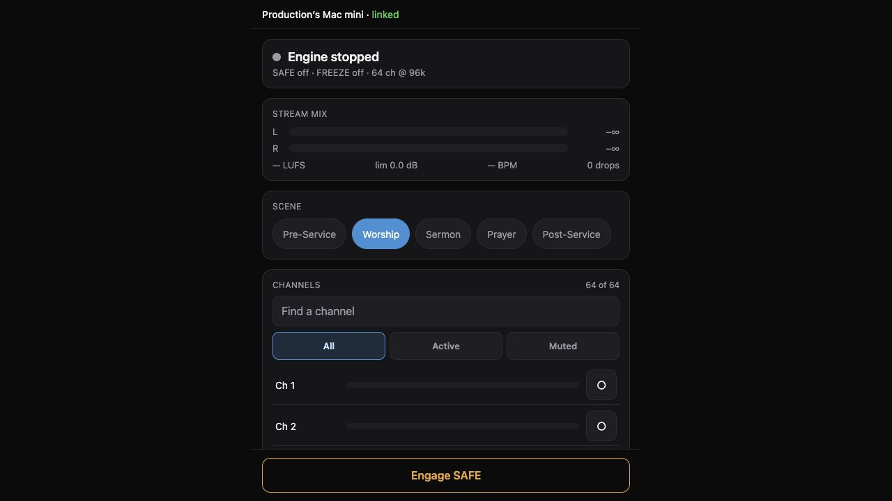

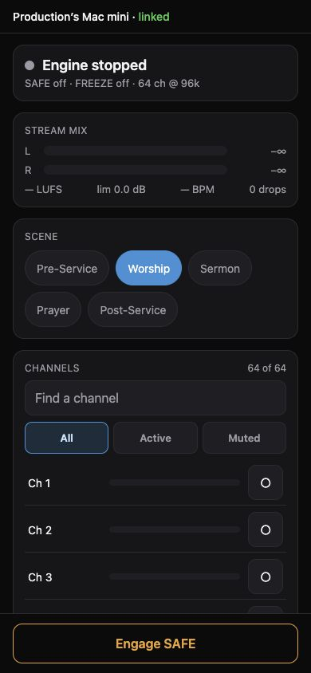

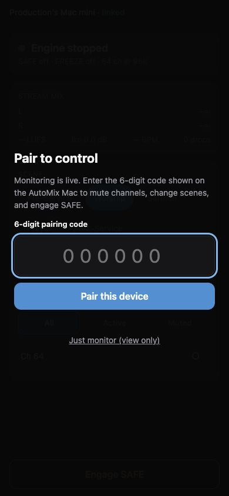

### Native macOS app

- Replaced the long utility-first Live surface with a browser-inspired operator console: persistent health and loudness, scene progression, a horizontally scrollable channel rack, master rail, and compact automation/runtime controls.
- Kept the native model and real telemetry wired through the redesigned channel strips, faders, mutes, roles, master meters, selected-channel controls, recovery, recording, and remote status.
- Preserved explicit Live, Setup, and Validate workspaces so routing and hardware proof stay available without dominating operation.
- Kept emergency SAFE engagement immediate while requiring confirmation before autonomous changes resume.
- Increased the contrast and minimum size of dense metadata labels and established a 1280 × 720 default content size.

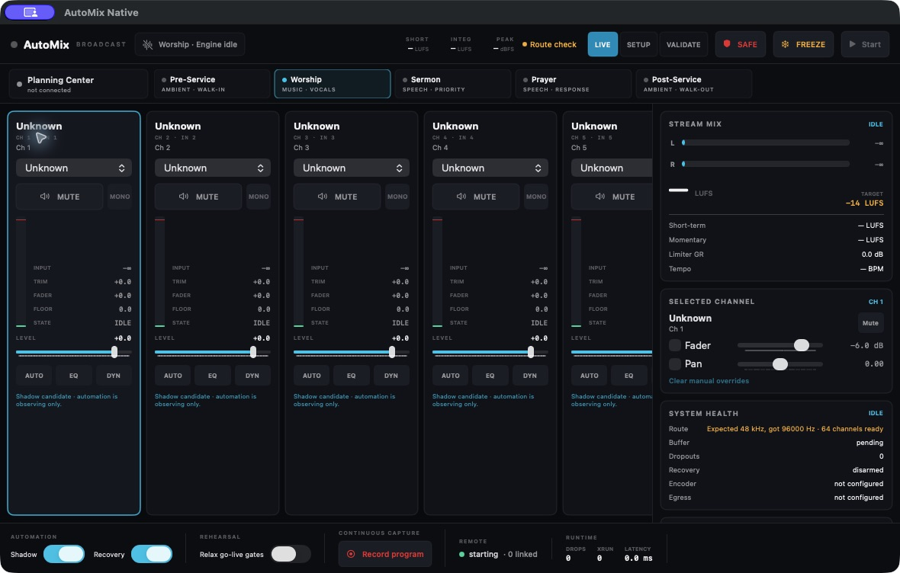

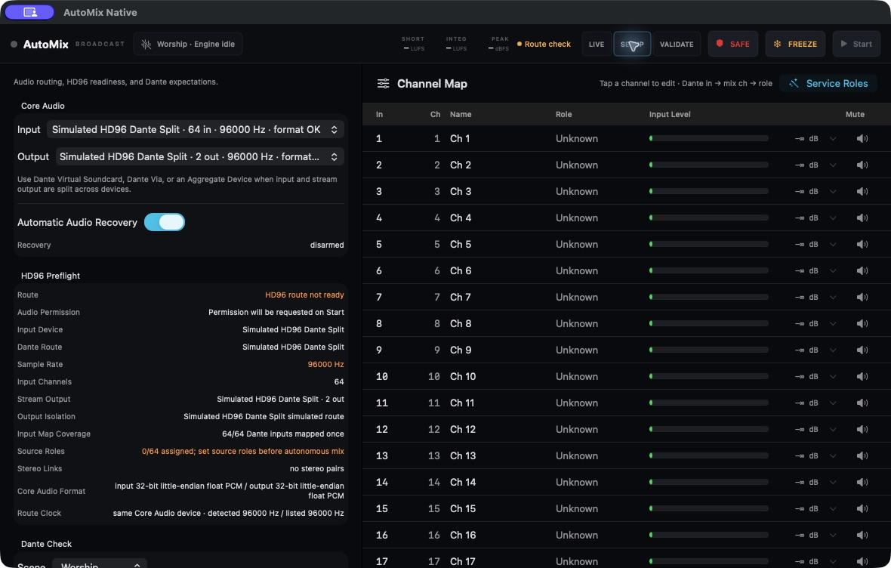

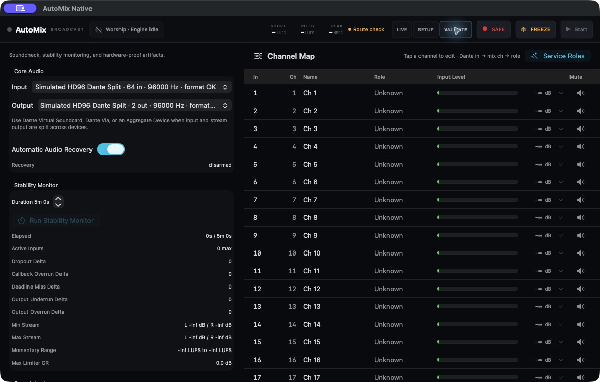

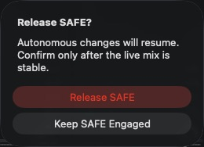

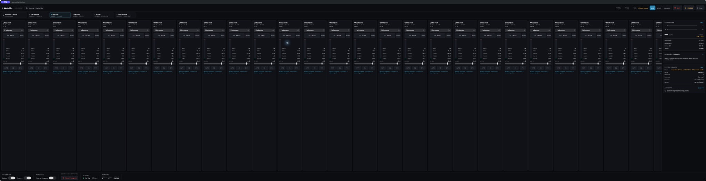

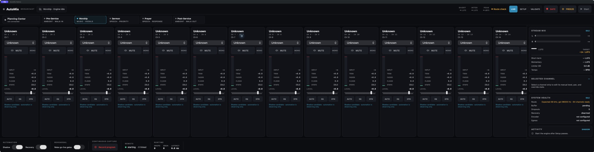

## Second hardening pass

The second pass focused on what can go wrong under live pressure: accidental interruption, accidental dismissal, keyboard escape paths, alarm visibility, and stale remote assets.

### Fresh running-product evidence

The following screenshots were captured after the second-pass changes from the running browser console and rebuilt native remote monitor.

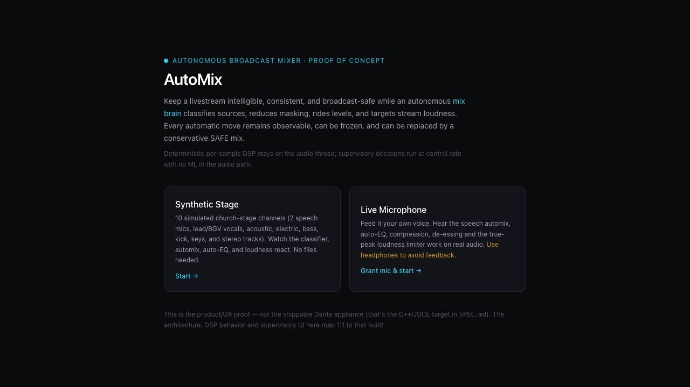

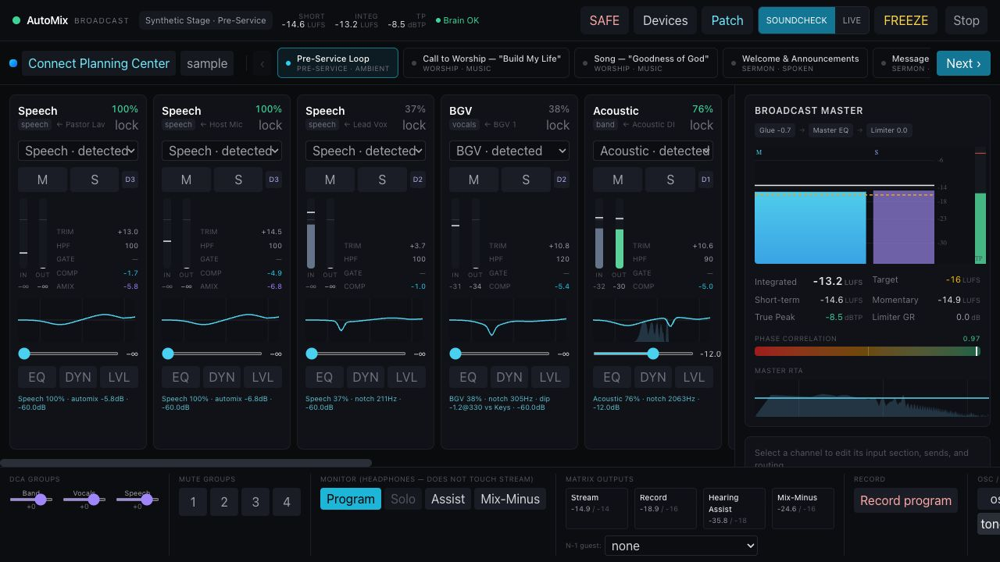

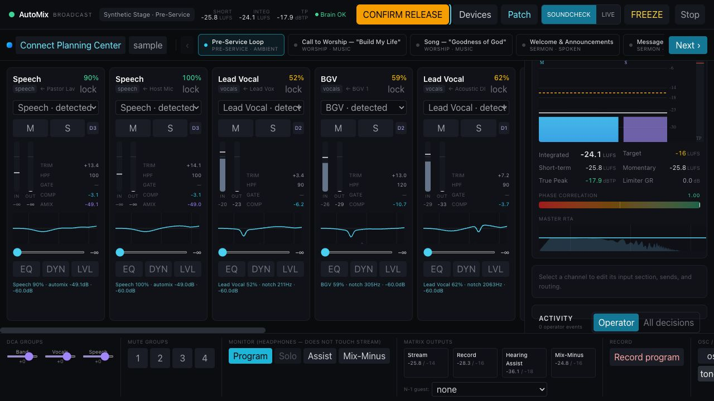

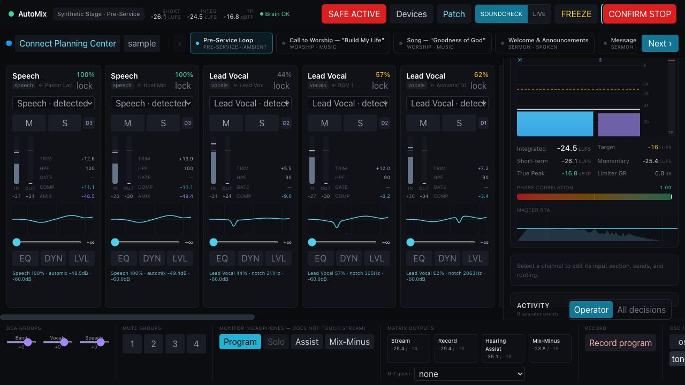

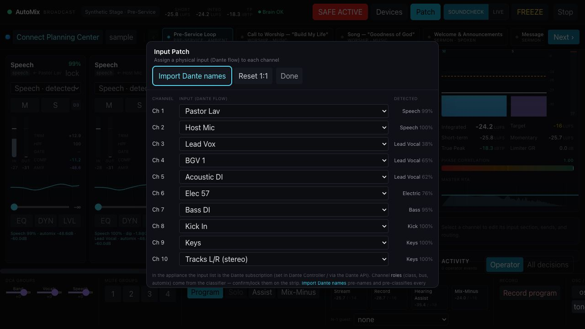

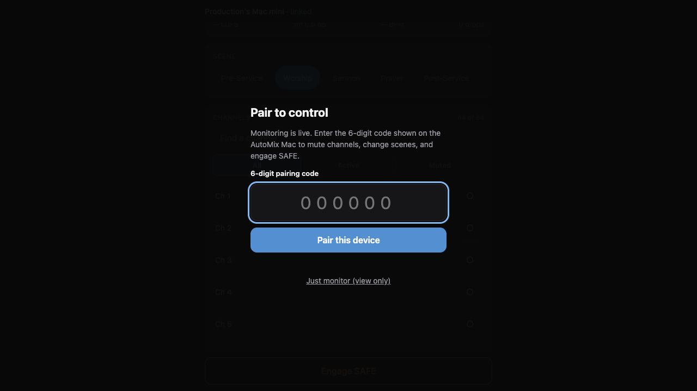

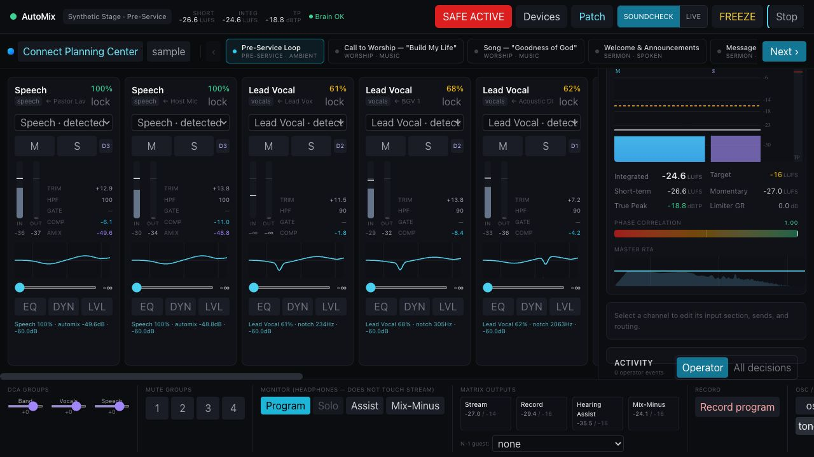

### Implemented

- Kept emergency SAFE engagement one-click while making SAFE release a deliberate, time-limited two-step action in the browser console and remote PWA.
- Made browser engine Stop a time-limited two-step action so a stray click cannot end program audio.
- Added native SwiftUI confirmation dialogs before releasing SAFE or stopping a running engine.
- Added a reusable browser dialog focus trap, focus return, and Escape close; removed accidental backdrop dismissal from Patch and Devices.
- Added equivalent keyboard focus containment to remote pairing while retaining inert background content and a view-only escape route.
- Replaced the undifferentiated decision stream with an operator-first Activity view. Detailed classifier and EQ automation remains available behind “All decisions.”
- Marked continuously animated canvas visualizations as presentational because live values already have textual equivalents.
- Added missing accessible state/labels to readouts, oscillator type, mix-minus routing, locks, mute/solo, and override targets.
- Increased compact channel-control hit areas without changing the console’s dense visual language.
- Made the 1280-pixel header more compact so confirmed destructive actions remain fully visible.
- Advanced the PWA cache and versioned its shell assets. Static shell requests now use network-first refresh with offline cache fallback, avoiding stale safety behavior after an update.

### Current end-to-end flow health

1. **Choose an input mode — healthy.** Operator outcome and feedback risk are clear.
2. **Start the synthetic stage — healthy.** The console opens directly with realistic telemetry and an explicit brain-health state.
3. **Confirm devices — healthy for the proof.** The dialog is labeled, keyboard-contained, Escape-dismissible, and explicit-close only.
4. **Patch inputs — healthy for the proof.** The mapping table is efficient, selectors are target-labeled, and modal focus wraps and returns correctly.
5. **Follow the service plan — mostly healthy.** Current and next cues are visible; the remaining risk is validating the real Planning Center service data and failure behavior.
6. **Supervise channels and master — mostly healthy.** Safety, scene, meters, and exceptions are legible, though the desktop proof intentionally remains denser than the intended native Live workspace.
7. **Use a narrow browser window — healthy.** Safety remains visible and wide operational regions scroll within their own containers.
8. **Monitor from a phone — healthy.** Status, stream health, scenes, search/filter, channels, and SAFE form a coherent touch workflow.
9. **Pair the phone — healthy.** The dialog is semantic, labeled, inert, focus-contained, Escape-dismissible, and returns focus.
10. **Use emergency controls — healthy.** SAFE engages immediately; SAFE release and engine Stop require confirmation and expire back to their safe default.
11. **Operate the native app — healthy in simulated operation.** Live/Setup/Validate, channel selection, and the native SAFE guard were exercised in the running app. Real HD96/Dante rehearsal evidence is still required before venue sign-off.

### Verification

- Browser TypeScript check: passed.
- Browser production build: passed.
- Native Debug build with signing disabled: passed.
- Native simulated 64-channel/96 kHz audio, telemetry, FREEZE, SAFE, recording, and soundcheck smoke: passed.
- Native Live, selected-channel, Setup, Validate, and SAFE confirmation states: visually verified.
- Native 5120 × 1410 production-display layout: verified after adding adaptive operator-console scaling.
- Ad-hoc-signed Release review package: extracted, signature-verified, and passed monitor and simulated-audio smoke tests.
- Remote static/auth/pairing/cookie/command/SSE monitor smoke: passed.
- Browser console verified at 1280 × 720 and 390 × 844.
- Remote console, channel search, and pairing focus verified at desktop and phone widths.
- Browser SAFE release and Stop confirmation timeouts: passed.
- Browser Patch focus wrap, Escape dismissal, and focus return: passed.
- Remote pairing focus boundary: passed against the rebuilt/versioned PWA shell.
- Diff whitespace validation: passed.

## Remote-control safety hardening

This follow-up combined UX/accessibility audit exercised the rebuilt remote PWA at a
390 × 844 phone viewport against the running native Debug app. It focused on the
control lifecycle during startup, live telemetry, loss of the Mac/server, and
automatic recovery.

### Current evidence

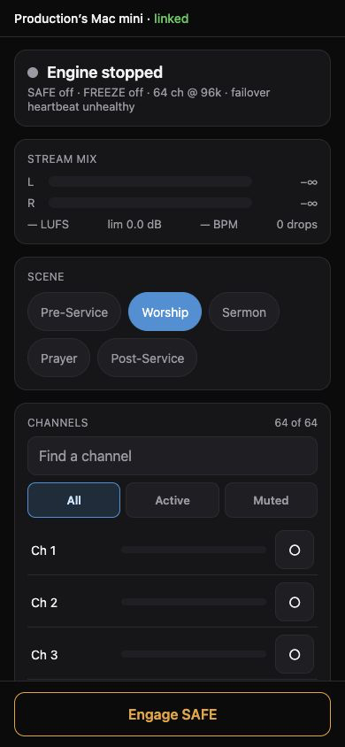

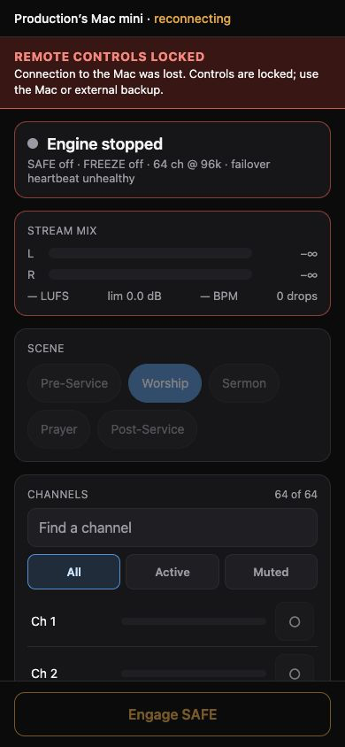

### Flow health

1. **Initial connection — healthy.** The PWA says `verifying live telemetry`, exposes
   a persistent lock banner, and keeps mutations disabled until it sees the snapshot
   timestamp advance. The transition lasts roughly one 10 Hz update and was verified
   in the live accessibility tree; it is too brief to serve as a stable screenshot.
2. **Advancing telemetry — healthy.** The lock banner clears only after timestamp
   progression. The header says `linked`; scene, channel, and SAFE controls enable.
3. **Mac/server loss — healthy.** The header changes to `reconnecting`, the red
   **Remote controls locked** banner explains the safe next action, stale meter fills
   are visually subdued, and all 70 mutation controls in the exercised snapshot are
   semantically disabled. Search, filters, and detail expansion remain usable because
   they do not alter the mix.
4. **Automatic recovery — healthy.** EventSource reconnects without a reload, requires
   timestamp progression again, then removes the banner and re-enables all 70
   mutation controls.
5. **Command delivery — healthy in integration evidence.** Commands carry the source
   snapshot timestamp; the server rejects missing/stale state, rejects stalled
   producer state, requires explicit SAFE-release confirmation, and returns a bounded
   failure when the control handler does not acknowledge. A monotonic execution clock
   expires work delayed more than 750 ms before routing, so it cannot execute after
   the phone reports timeout.

### Audit findings

- The first rendered implementation briefly called the server's initial empty frame
  `invalid telemetry`. It now uses the calmer and more accurate `waiting` /
  `verifying` states until a complete advancing snapshot exists.
- A first snapshot is no longer sufficient to unlock control. This closes the
  reconnect case where the embedded server can immediately replay its last encoded
  frame before the main loop publishes a new one.
- A telemetry timestamp must move forward. A backward jump immediately resets the
  freshness gate and requires a new two-frame baseline, preventing a clock regression
  from masquerading as producer activity.
- The loss state preserves the established console hierarchy. The high-priority lock
  explanation is visible without obscuring the last-known mix, while disabled state,
  amber connection text, red boundaries, and subdued meters reinforce that those
  values are historical.
- The lock banner is an assertive live region, the command result is a polite live
  region, native `disabled` semantics cover every mutation control, and the viewport
  permits browser zoom. The
  screenshots support visual review only; a real VoiceOver/TalkBack session is still
  required before claiming screen-reader conformance.

No actionable P0, P1, or P2 finding remains in this bounded remote-control-loss flow.
The remaining evidence gap is a real phone on the venue management Wi-Fi with an
operator, including background/resume and a deliberate access-point interruption.

## Third operator-safety pass

This pass reviewed the redesigned browser console as a running operator flow rather
than as a set of static screens. It concentrated on whether the interface tells the
truth while automation is moving, whether an unavailable service-plan integration
leaves an operator with a usable recovery path, and whether the broadcast master
distinguishes input pressure from actual stream-output safety.

### Current evidence

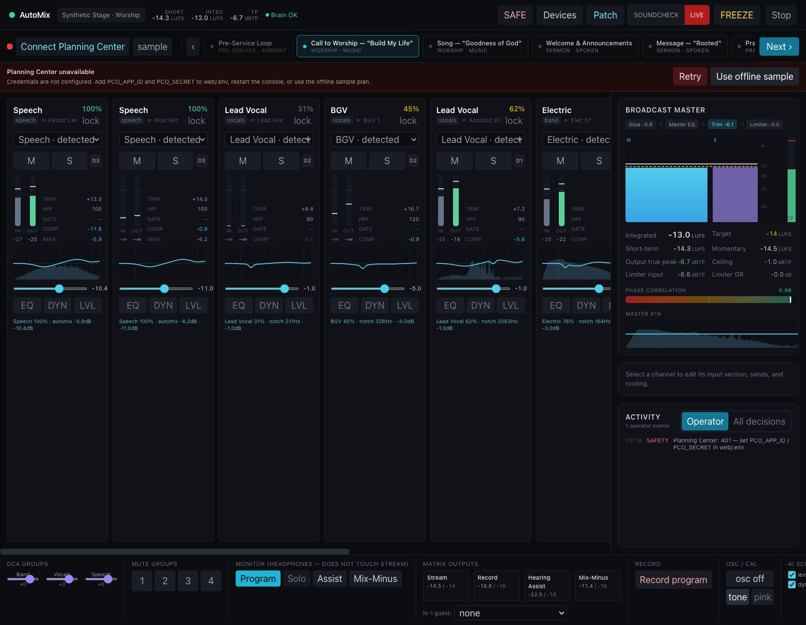

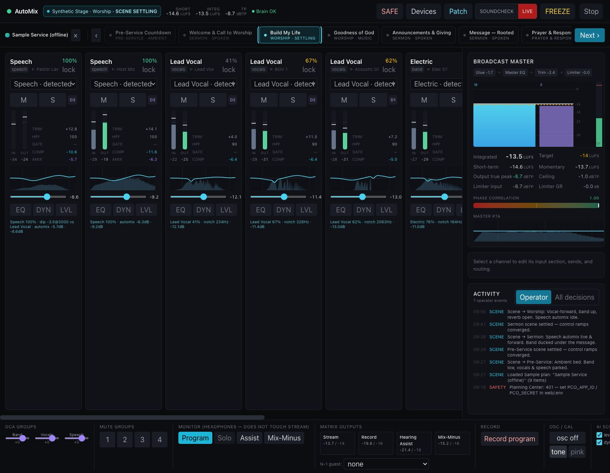

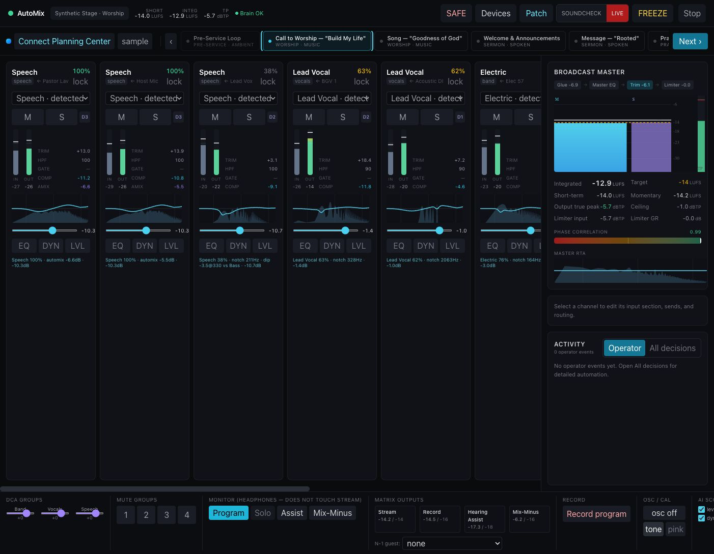

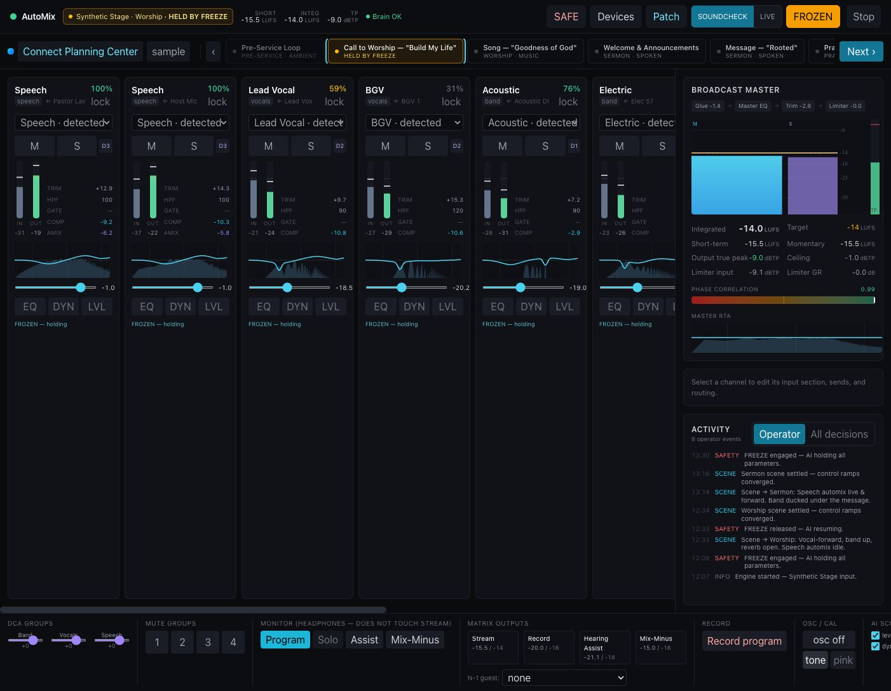

### Flow health

1. **Cue a service scene — healthy.** The header and active cue expose
   `SCENE SETTLING` while scene balance is moving, then clear only after the fader
   targets converge and the minimum transition window elapses. The activity feed
   records the scene request and its later settled state as separate events.
2. **Cue while FREEZE or SAFE is active — healthy.** The selected cue remains visible
   but changes to `HELD BY FREEZE`, `HELD BY SAFE`, or
   `HELD BY SAFE + FREEZE`. Scene-side effects and automatic control changes wait
   behind that hold; releasing it begins the transition instead of revealing an
   already-moved background mix.
3. **Recover from Planning Center failure — healthy in the local failure state.**
   A full-width alert names the failure, gives credential/network-specific guidance,
   and offers both Retry and Use offline sample. The offline path returns the console
   to an operable service plan without restarting audio.
4. **Read master safety — healthy in browser simulation.** `Output true peak` is now
   measured after the limiter and shown separately from `Limiter input`, the
   configured ceiling, and limiter gain reduction. The slow, bounded master trim is
   visible in the signal-chain chips instead of silently changing gain.
5. **Accessibility — bounded verification.** Transition and connection failures use
   status/alert semantics; the active cue exposes busy/current state; controls have
   descriptive accessible names. DOM and keyboard-state inspection passed for these
   flows. Screenshots cannot prove contrast conformance, announcement quality in a
   screen reader, touch behavior, or operability with real assistive technology.

### Implemented

- Added an explicit, convergence-bound scene-transition state with held states for
  FREEZE and SAFE.
- Replaced the clipped Planning Center error with an actionable recovery alert and
  offline-plan escape path.
- Corrected the master meter so `Output true peak` is post-limiter telemetry rather
  than the limiter-input peak.
- Added separate ceiling, limiter-input, and limiter-reduction readouts.
- Added a slow live-mode loudness normalization trim with a 0.25 LU deadband,
  bounded per-tick movement, and an observable `Trim` chip.
- Reworked the look-ahead limiter so each delayed sample receives the most
  conservative gain request from its full look-ahead window.
- Added deterministic sustained-overload, transient, and sub-ceiling worklet tests.

### Verification

- Browser TypeScript check: passed.
- Browser production build: passed.
- Browser/remote safety tests: **9 passed, 0 failed**, including three limiter tests.
- Sustained 2.5× overload and isolated ±4.0 impulses remained at or below
  **-0.9 dBTP** in the deterministic worklet harness; sub-ceiling material produced
  no false gain reduction.
- Running synthetic Worship scene: the short-term reading converged from
  **-8.3 LUFS** to a steady **-13.7 to -14.2 LUFS** around the **-14 LUFS** target,
  with no `OUTPUT OVER` state in the 28-second observation.
- Running scene timing: settling remained visible at 1.5 seconds and cleared after
  convergence by approximately 2.15 seconds in the exercised transition.
- Planning Center missing-credential recovery, offline fallback, normal settling,
  FREEZE hold, SAFE + FREEZE hold, and resumed settling were inspected in the live
  accessibility tree.
- Diff whitespace validation: passed.

No actionable P0 or P1 finding remains in this bounded browser operator flow. The
remaining P2 concern is the intentionally dense desktop typography, which needs
operator validation on the real production display before increasing density or
reducing the master rail further.

## Remaining product-level work

- Test the native app with HD96/Dante hardware at the real venue and capture a full operator rehearsal on the production display.
- Run a rehearsal usability study with a technical director who did not build the system.
- Validate color contrast and keyboard/screen-reader behavior with automated and manual accessibility tooling.
- Validate the implemented LIVE policy—SAFE, scenes, and channel overrides remote;
  FREEZE local-only—and the fail-closed loss/recovery behavior with real operators on
  the venue Wi-Fi.
- Establish design tokens shared by SwiftUI, the remote PWA, and the browser proof so safety, warning, healthy, and manual-override states stay semantically consistent.
